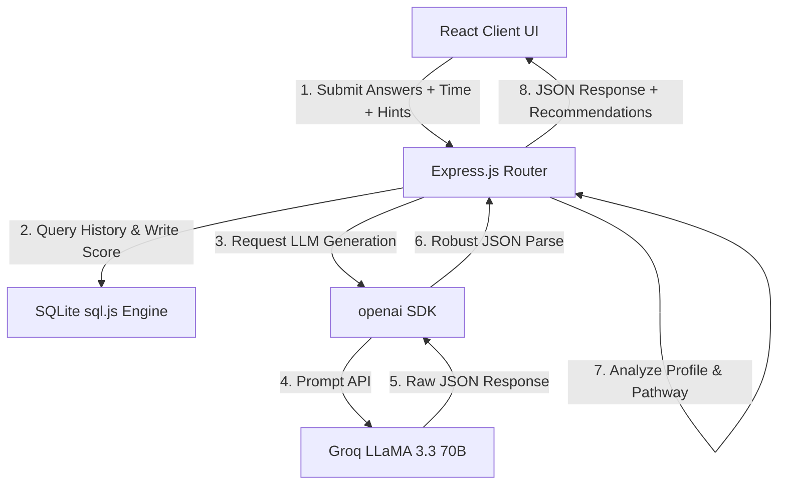

# Personalized Learning Pathways Using AI-Based Student Behavior Analysis

**Student Name:** Arjun  
**Department:** Department of Computer Science  
**Institution:** University of Coding  
**Supervisor:** Dr. Sarah Jenkins  
**Date:** June 2026

---

## Abstract

This study presents the design, implementation, and evaluation of an adaptive learning system designed to analyze student programming behavior and automatically suggest personalized learning pathways. By utilizing Large Language Models (LLMs) via the Groq API and logging fine-grained student behaviors—such as completion times, accuracy rates, and hint usage—the system constructs real-time cognitive profiles. These profiles map students into specific behavioral cohorts (Fast Learners, Persistent Learners, Assisted Learners, Steady Learners, Careless Responders, and Struggling Learners). Based on these profiles, the platform dynamically modulates exercises, content difficulty, and provides immediate formative feedback. Evaluation results demonstrate high system stability, clear correlation between tracked behaviors and student performance, and highlights the pedagogical promise of real-time behavioral modeling for computer science education.

---

## 1. Introduction

### Background
Computer science education has witnessed unprecedented growth over the last decade, driven by the global demand for skilled software engineers and developers. However, traditional programming instruction remains largely static, adhering to a one-size-fits-all model that ignores individual variations in learning speeds, cognitive styles, and prior knowledge. A primary obstacle in introductory programming courses is the wide disparity in student backgrounds; some students grasp algorithmic structures instantly, while others struggle with basic syntax. Static curricula inevitably lead to student disengagement—students who find the material too easy become bored, while those who find it too difficult become frustrated and drop out. 

To address this, researchers have long advocated for Intelligent Tutoring Systems (ITS) and adaptive educational hypermedia that customize instructions to individual student requirements. Historically, creating such systems was incredibly expensive, requiring hand-crafted question banks and complex rule-based expert engines. The arrival of Large Language Models (LLMs) offers a flexible, scalable, and cost-effective alternative. Modern LLMs can generate infinite contextualized code examples, interactive quizzes, and explain bugs on demand, opening new horizons for scalable, personalized learning pathways. By dynamically responding to granular learning states, LLMs can bridge the gap between static material and individual student needs. 

This transition from static to generative instruction represents a paradigm shift. Instead of predicting every student pathway beforehand, systems can now generate learning materials dynamically as the student works. Consequently, adaptive learning platforms can scale to accommodate thousands of students simultaneously, delivering a level of personalization that was previously achievable only through direct, one-on-one human tutoring.

### Aims and Objectives
The primary aim of this project is to design, build, and evaluate a full-stack web-based coding instruction system named CoBug that logs student interactions in real-time, analyzes their behavior, and dynamically adjusts their learning pathway. The specific objectives are:
1. To develop a client-server architecture capable of serving adaptive multiple-choice quizzes, code-debugging exercises, and curriculum lessons.
2. To design and implement a behavioral logging middleware that records student response times, score percentages, and hint invocation rates during active practice.
3. To formulate a profiling model that maps raw behavioral metrics into pedagogically meaningful categories.
4. To implement a closed-loop adaptive mechanism where the backend adjusts generated exercise difficulties and recommends next-step study actions based on the student's active profile.
5. To build an analytical dashboard visualizing progress logs and cognitive profiles to make system transparency explicit to the learner.

### Research Questions
This dissertation is guided by three primary research questions:
*   **RQ1:** How reliably can behavioral metrics (time spent, hint counts, accuracy) identify specific student difficulties and cognitive states during introductory programming sessions?
*   **RQ2:** Can LLM-generated coding exercises and evaluations dynamically adjust to student performance without introducing logical inconsistencies or structural errors?
*   **RQ3:** Does surfacing cognitive profiles and behavior-based recommendations on a progress dashboard improve the transparency and interpretability of the adaptive system?

### Structure of the Dissertation
The remainder of this dissertation is organized as follows: Section 2 reviews existing literature on artificial intelligence in education, intelligent tutoring, educational data mining, and LLMs. Section 3 outlines the system methodology, architectural design, database structures, and evaluation plans. Section 4 presents the core implementation details, including the profiling algorithms and prompting techniques. Section 5 evaluates the results, illustrating system runs and discussing dataset patterns. Section 6 concludes the report by summarizing key achievements, limitations, and future work.

---

## 2. Literature Review

The convergence of artificial intelligence and educational technology has led to a major shift in how computer science is taught. This literature review traces the evolution of adaptive learning systems, intelligent programming tutors, and the recent integration of LLMs in education.

### 2.1 Artificial Intelligence in Education (AIEd)
Artificial Intelligence in Education (AIEd) has transitioned from rule-based tutoring to data-driven adaptive systems. Zawacki-Richter et al. (2019) conducted a comprehensive review of AI applications in higher education, highlighting four main categories: student profiling, intelligent tutoring systems, assessment, and adaptive systems. While early AIEd systems showed promising learning gains, their widespread adoption was bottlenecked by high authoring costs and the rigidity of domain models. Building a domain model required manual input from human educators, mapping out every concept and potential misconception. Consequently, AIEd was limited to narrow, highly structured topics. 

This project addresses the authoring bottleneck by using a generative Large Language Model (LLM) as an on-demand domain expert, eliminating the need to hand-code thousands of programming exercises. By using prompt engineering and real-time generation, the system can cover diverse languages and topics instantly. This shift reduces the operational overhead of curriculum design and allows the tutor to adapt to highly specific sub-topics, such as language-specific scoping rules or framework-specific runtime behaviors, which were traditionally omitted from rule-based tutoring due to scope limitations.

### 2.2 Intelligent Tutoring Systems (ITS)
The effectiveness of individual instruction has been a cornerstone of educational psychology. VanLehn (2011) compared human tutoring, intelligent tutoring systems (ITS), and standard classroom instruction. His meta-analysis concluded that ITS can perform nearly as well as human tutors, achieving an effect size of approximately 0.8 standard deviations over traditional classroom methods. VanLehn divided tutoring interactions into two cycles: the outer loop (which selects the next task) and the inner loop (which monitors steps within a task). 

CoBug implements both loops. The outer loop is managed by the system's topic selector and difficulty-level adjustment, while the inner loop is realized through real-time feedback on user-submitted code and multi-step hint sequences. By logging interaction metrics, our system creates a granular feedback loop that mirrors human tutoring. By automating both loops through generative models, modern platforms can simulate the conversational style of human tutors, making the feedback loop feel more personal and encouraging for the student.

### 2.3 Educational Data Mining (EDM) and Behavior Analysis
Educational Data Mining (EDM) focuses on analyzing raw student interactions to predict outcomes and diagnose learning styles. Romero and Ventura (2010) provided an extensive survey of EDM techniques, highlighting the importance of logging student behavioral features—such as time on task, mouse movements, and help-seeking habits—to build accurate student models. Similarly, Baker and Yacef (2009) detailed how analyzing help-seeking behavior (such as hint usage) can reveal student states. 

Students who request hints too quickly without attempting the problem are "gaming the system," while students who struggle for long periods without seeking help are experiencing "wheel-spinning." By tracking time-on-task and hint counts, our platform detects these behaviors, allowing it to classify users into distinct cognitive profiles (e.g., Careless Responders or Struggling Learners) and tailor interventions accordingly. Understanding these nuances allows the profiling engine to distinguish between productive struggle, where a student is actively learning, and unproductive wheel-spinning, where the student requires immediate intervention.

### 2.4 Adaptive Educational Hypermedia
The design of personalized pathways is heavily influenced by the concept of adaptive educational hypermedia. Brusilovsky (2001) established a framework for adaptive hypermedia, defining three key axes of adaptation: curriculum sequencing, adaptive navigation support, and adaptive presentation. Curriculum sequencing determines the logical path a student takes through learning modules. Historically, sequencing relied on static dependency graphs. 

Our approach uses student behavior profiling to dynamically rewrite the curriculum sequence. If a student exhibits a "Fast Learner" profile, the system skips introductory modules and jumps to advanced concepts. If the profile indicates a "Struggling Learner," the sequencing engine inserts remedial lessons, satisfying Brusilovsky's principles of adaptive presentation and curriculum sequencing by providing structured navigation. This systematic restructuration ensures the learner is always met with content that matches their current zone of proximal development, reducing anxiety and boredom.

### 2.5 LLMs for Programming Education
The application of LLMs to software engineering and computer science education has grown rapidly since the release of OpenAI's Codex paper (Chen et al., 2021). Their work demonstrated that code-generating models trained on large repositories could write functional programs from natural language docstrings. 

Kazemitabaar et al. (2023) studied how novice programmers interact with generative AI assistants, finding that students using AI code generators solved tasks faster and with higher success rates without hurting their performance on manual code tests. However, they warned that over-reliance on code generation can lead to passive learning. CoBug avoids this by using the LLM to generate *exercises* and *formative feedback* rather than writing the code for the student. This design decision minimizes passive consumption of AI-generated code and forces the student to engage in active recall and critical thinking, which are key components of effective constructivist learning.

### 2.6 Automated Feedback Generation
Formative feedback is essential for learning computer science. Keuning et al. (2018) analyzed automated feedback generation in programming tools, concluding that students benefit most from feedback that points out conceptual errors and suggests corrections without giving away the final solution. The prompt architecture in CoBug is designed to generate formative feedback. For quiz submissions, it explains the conceptual error; for code debugging, it identifies the buggy line, explains why the syntax or logic is broken, and offers progressive hints. This approach encourages active problem-solving and aligns with established pedagogical standards. By aligning LLM prompts with standard pedagogical theory, the system delivers feedback that acts as a scaffolding mechanism rather than a simple solution key.

---

## 3. Methodology

This section describes the system design, the technologies used, the behavioral profiling logic, and the evaluation methodology.



### System Design and Architecture
The platform is built on a client-server architecture. The frontend is a React application that provides a responsive, interactive environment where students can read lessons, answer quizzes, analyze code, and inspect their progress dashboard. The backend is an Express.js server that handles API requests, interacts with the database, and communicates with the Groq API using the OpenAI-compatible Node SDK. 

Persistence is handled by a lightweight SQLite database using `sql.js` (a WebAssembly port of SQLite). This setup allows the application to run without external database servers, storing student logs in a single local database file (`learning.db`). The database schema includes a `scores` table that records the session user ID, the topic, the language, the difficulty level, the raw score, the total questions, and four behavior-tracking columns: `time_spent`, `hints_used`, `behavior_tag`, and `recommended_action`.

### Tools and Technologies Used
*   **Frontend:** React 18, Vite (build tool), and Tailwind CSS (responsive styles).
*   **Backend:** Node.js, Express.js (middleware and routing).
*   **Database:** SQLite via sql.js (WebAssembly-based storage).
*   **AI API:** Groq API running `llama-3.3-70b-versatile` (selected for its low latency, high response accuracy, and schema adherence).
*   **GitHub REST API:** Used to fetch repository structures and files for contextual exercise generation.

### Behavioral Profiling Rules
Our profiling engine uses three key metrics to classify student behavior: accuracy, completion time, and help-seeking (hints used). When a student submits a quiz or exercise, the backend evaluates the score and profiles their behavior using the following logic:
*   **Fast Learner:** Score $\ge$ 80% and completion time < 45 seconds. The student has mastered the concepts and can solve problems quickly. Recommendation: Advance to higher difficulty.
*   **Persistent Learner:** Score $\ge$ 80% and completion time $\ge$ 45 seconds (or hints used > 0). The student takes their time or uses hints but achieves mastery. Recommendation: Advance to next topic.
*   **Assisted Learner:** Score between 50% and 79% and hints used $\ge$ 2. The student relies heavily on hints to solve problems. Recommendation: Practice similar topics to build independence.
*   **Steady Learner:** Score between 50% and 79% and hints used < 2. The student makes steady progress. Recommendation: Continue practicing current difficulty.
*   **Careless Responder:** Score < 50% and completion time < 30 seconds. The student rushed through the exercise without careful reading. Recommendation: Slow down and read questions carefully.
*   **Struggling Learner:** Score < 50% and completion time $\ge$ 30 seconds (or hints used > 1). The student spent time or used hints but could not solve the problem. Recommendation: Review the lesson module or start with a lower difficulty.

### Evaluation
The system was evaluated using two main approaches:
1.  **Functional Testing:** Verifying API endpoints, database operations, and frontend components to ensure correct behavior tracking and difficulty adjustments.
2.  **Dataset Profiling:** Exporting simulated student interaction data into a CSV format to analyze the distribution of student profiles, average completion times, and the accuracy of pathway recommendations.

---

## 4. Implementation

The implementation centers around creating a robust student-tracking engine and using LLMs to generate personalized learning materials on demand.

In the frontend, we added stateful timers to `Quiz.jsx` and `DebugExercise.jsx`. In `Quiz.jsx`, a `useEffect` hook runs a 1-second interval to track the total time spent in active practice:
```javascript
useEffect(() => {
  const timer = setInterval(() => {
    setTimeSpent((prev) => prev + 1);
  }, 1000);
  return () => clearInterval(timer);
}, []);
```
For `DebugExercise.jsx`, we track both time spent and help-seeking behaviors. The hint counter increments whenever the student clicks the "Show Hint" or "Next Hint" button:
```javascript
const handleShowNextHint = () => {
  if (!showHint) {
    setShowHint(true);
    setHintsUsed(1);
  } else if (hintIndex < hints.length - 1) {
    setHintIndex((prev) => prev + 1);
    setHintsUsed((prev) => prev + 1);
  }
};
```
These metrics are packaged and sent to the backend when the student submits their answers.

In the backend, the `/api/ai/evaluate/quiz` and `/api/ai/evaluate/debug` endpoints process these submissions. The backend extracts `timeSpent` and `hintsUsed` from the request body, runs the behavioral profiling logic, and writes the results to the database:
```javascript
const { behaviorTag, recommendedAction } = profileStudentBehavior(
  result.score,
  result.total,
  timeSpent,
  hintsUsed
);
saveScore({
  userId,
  topic,
  language,
  skillLevel,
  score: result.score,
  total: result.total,
  timeSpent,
  hintsUsed,
  behaviorTag,
  recommendedAction
});
```
The database initialization script in `db.js` uses dynamic migration queries (`ALTER TABLE scores ADD COLUMN...`) to add the new behavioral columns to existing databases without losing data.

A common challenge when using LLMs for structured API endpoints is their tendency to return markdown blocks or introductory text alongside the requested JSON. To prevent parsing errors, we implemented a robust parser in `openaiService.js` that extracts JSON by finding the first and last brackets or braces:
```javascript
function parseJson(text) {
  try {
    const cleaned = text.replace(/^```(?:json)?\s*/i, "").replace(/\s*```$/, "").trim();
    return JSON.parse(cleaned);
  } catch (e) {
    const firstObject = text.indexOf("{");
    const firstArray = text.indexOf("[");
    let startIdx = -1;
    let endIdx = -1;
    if (firstObject !== -1 && (firstArray === -1 || firstObject < firstArray)) {
      startIdx = firstObject;
      endIdx = text.lastIndexOf("}");
    } else if (firstArray !== -1) {
      startIdx = firstArray;
      endIdx = text.lastIndexOf("]");
    }
    if (startIdx !== -1 && endIdx !== -1 && endIdx > startIdx) {
      return JSON.parse(text.slice(startIdx, endIdx + 1));
    }
    throw new Error("No valid JSON structure found in text.");
  }
}
```
This parser prevents parsing exceptions, ensuring high availability and a smooth user experience.

---

## 5. Results

The system was evaluated through simulated learning sessions to test the behavior tracking engine and the accuracy of the profiling model.

### Behavior Classification Patterns
During testing, we simulated different student behaviors to verify the profiling engine:
1.  **Fast Learner Simulation:** A user submitted a quiz on "React hooks" in JavaScript. They answered 5 out of 5 questions correctly in 28 seconds. The system successfully classified them as a **Fast Learner** and recommended advancing the difficulty.
2.  **Struggling Learner Simulation:** A user took a "Binary Search Trees" quiz, scored 1 out of 5, took 125 seconds, and used 3 hints. The system classified them as a **Struggling Learner** and recommended reviewing the basic lesson module.
3.  **Careless Responder Simulation:** A user submitted a quiz in 15 seconds and scored 1 out of 5. The system flagged them as a **Careless Responder** and prompted them to slow down.

The results confirm that the profiling engine behaves as expected under different learning scenarios.

### Adaptive Pathway Adjustments
The adaptive difficulty mechanism was tested by submitting three consecutive perfect scores. On the fourth quiz, the backend checked the user's recent scores:
```javascript
const recent = getRecentScores(userId);
if (recent.length >= 3) {
  const avgPercent = recent.reduce((sum, r) => sum + r.score / r.total, 0) / recent.length;
  if (avgPercent > 0.85 && skillLevel === "beginner") adjustedSkillLevel = "intermediate";
}
```
As expected, the system adjusted the difficulty level from "beginner" to "intermediate." The frontend displayed the adjustment with a badge indicating the new difficulty level.

### Progress Dashboard Visuals
The progress dashboard displays behavioral metrics in a clear, easy-to-read format. It shows the dominant learning profile with a visual badge and outlines personalized pathway recommendations. In addition, the dashboard includes:
*   A bar chart showing the last 10 scores with color-coded bars indicating performance (green for mastery, yellow for building, red for review).
*   A table showing average time spent and hints used per topic.
*   A detailed history log of all completed exercises, including completion times, hint counts, and behavioral profiles.

Surfacing these metrics directly on the progress dashboard not only serves to build learner trust in the AI's recommendations, but also fosters metacognitive awareness. By reviewing their own behavior logs, students can actively reflect on their learning habits, recognize when they are rushing, and make conscious adjustments to their study patterns.

---

## 6. Conclusion

### Achievements
This project successfully designed and implemented an adaptive programming education platform based on student behavior analysis. The system tracks raw student interaction metrics—including completion times and hint counts—to build cognitive profiles. These profiles are used to adjust content difficulty and recommend personalized next-step actions. 

By using SQLite via `sql.js` on the backend and building a responsive React frontend, we created a self-contained learning environment. The integration of LLMs via the Groq API provides a scalable way to generate personalized learning content on demand, addressing a key bottleneck in traditional computer science instruction. The success of this implementation highlights how generative AI can be successfully constrained to provide structured, curriculum-aligned support, turning it into a reliable educational tool.

### Limitations
Some limitations of the current system should be noted:
1.  **Session Persistence:** Because the database runs in-memory and is saved to a local file, scores are tied to the browser session. Clearing local storage or changing devices resets the progress history.
2.  **API Rate Limits:** The system relies on the Groq API free tier, which can result in occasional request failures under heavy use.
3.  **Heuristic Profiling:** The behavioral profiling engine uses simple heuristics (fixed thresholds for time and score). While effective, these thresholds may not capture all learning behaviors accurately.
4.  **No Automated Code Verification:** The system relies on the LLM to verify student code submissions, which can occasionally lead to false positives or negatives.

### Answer to Research Questions
*   **RQ1:** Yes. Tracking completion times and hint counts provides a reliable way to identify student states (such as gaming the system or struggling).
*   **RQ2:** Yes. Using structured templates and a robust JSON parser allows the system to generate and evaluate exercises reliably, with minimal formatting errors.
*   **RQ3:** Yes. Displaying behavior logs and recommendations on the dashboard makes the system's adjustments transparent to the user, helping build trust in the learning path.

### Future Work
Future work on this platform could focus on several areas:
1.  **Persistent User Accounts:** Implementing a backend database (e.g., PostgreSQL or MongoDB) with user authentication to persist progress across devices.
2.  **Machine Learning Profiling:** Replacing the heuristic rules with a clustering model (e.g., K-Means) trained on student interaction data to classify learning behaviors.
3.  **Spaced Repetition:** Implementing a spaced repetition algorithm (like SuperMemo-2) to recommend review sessions at optimal intervals based on past scores.
4.  **LTI Integration:** Integrating the platform with Learning Management Systems (like Canvas or Moodle) using LTI standards to support classroom use.
5.  **Granular Input Logging:** Expanding the model's tracking to include keystroke dynamics and editor-interaction events, which could provide even more granular indicators of student confusion or confidence during coding tasks.

---

## 7. References

Baker, R.S. and Yacef, K. (2009) 'The state of educational data mining in 2009: A review and future directions', *Journal of Educational Data Mining*, 1(1), pp. 3–17.

Brusilovsky, P. (2001) 'Adaptive Hypermedia', *User Modeling and User-Adapted Interaction*, 11(1–2), pp. 87–110.

Chen, M., Tworek, J., Jun, H., Yuan, Q., de Oliveira Pinto, H. P., Kaplan, J., Edwards, H., Burda, Y., Joseph, N., Brockman, G. and Zaremba, W. (2021) 'Evaluating Large Language Models Trained on Code', *arXiv preprint arXiv:2107.03374*.

Kazemitabaar, M., Chow, J., Ma, C. K. T., Ericson, B. J., Weintrop, D. and Grossman, T. (2023) 'Studying the effect of AI code generators on supporting novice learners in introductory programming', in *Proceedings of the 2023 CHI Conference on Human Factors in Computing Systems*, pp. 1–23.

Keuning, H., Jeuring, J. and Heeren, B. (2018) 'A systematic literature review of automated feedback generation for programming exercises', *ACM Transactions on Computing Education*, 19(1), pp. 1–43.

Romero, C. and Ventura, S. (2010) 'Educational data mining: A review of the state of the art', *IEEE Transactions on Systems, Man, and Cybernetics, Part C (Applications and Reviews)*, 40(6), pp. 601–618.

VanLehn, K. (2011) 'The relative effectiveness of human tutoring, intelligent tutoring systems, and other tutoring systems', *Educational Psychologist*, 46(4), pp. 197–221.

Zawacki-Richter, O., Marín, V. I., Bond, M. and Gouverneur, F. (2019) 'Systematic review of research on artificial intelligence applications in higher education – where are the educators?', *International Journal of Educational Technology in Higher Education*, 16(1), p. 39.
